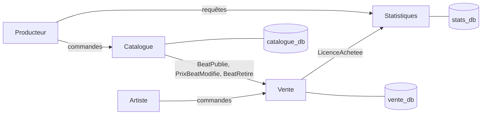

# BeatShop : vente de licences de beats

Projet NoSQL, Mastère Data Engineering & IA (EFREI Paris).
Auteur : Lonny Michely.

## Descriptif

BeatShop est une petite plateforme où un producteur publie des instrumentales (beats) et où des artistes achètent une licence pour les utiliser dans leurs morceaux.

L'application est découpée en **trois services autonomes**. Chacun possède sa propre base de données. Les services ne lisent jamais la base d'un autre : ils communiquent uniquement par **événements**.

| Service | Responsabilité | Utilisateur |
|---|---|---|
| **Catalogue** | Publier un beat, modifier son prix, le retirer de la vente | Producteur |
| **Vente** | Acheter une licence, consulter ses achats | Artiste |
| **Statistiques** *(projection)* | Classement des beats les plus rentables | Producteur |

## Point de vue de l'utilisateur

- **Le producteur** publie un beat (titre, BPM, style, prix de chaque licence). Il peut ensuite changer un prix, retirer le beat de la vente et consulter ses meilleures ventes.
- **L'artiste** parcourt les beats disponibles, achète une licence (`BASIC` ou `PREMIUM`) et retrouve l'historique de ses achats.

## Choix techniques

- **Base de données** : MongoDB (modèle document). Un agrégat est stocké dans un seul document. On le lit et on l'écrit donc en une seule opération atomique, sans jointure.
- **Une base par service** : `catalogue_db`, `vente_db` et `stats_db`.
- **Communication** : des événements immuables et versionnés (`v1`), chacun avec un identifiant unique `idEvenement`.
